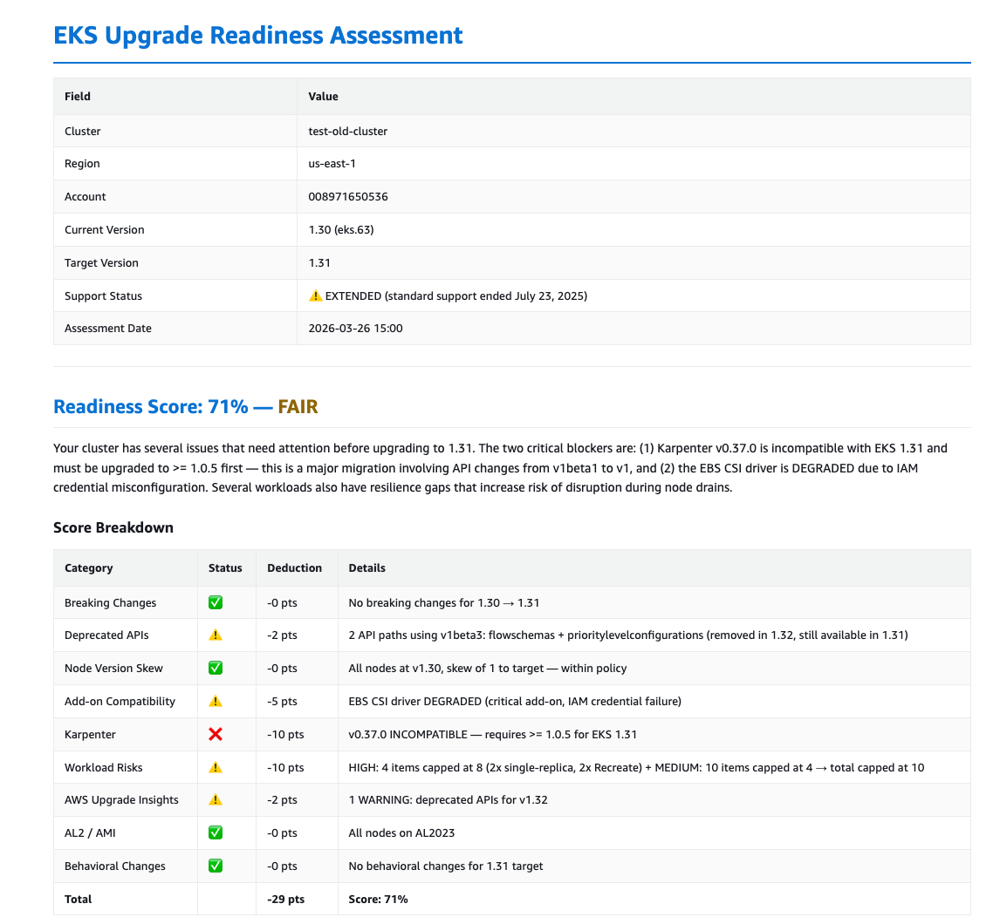
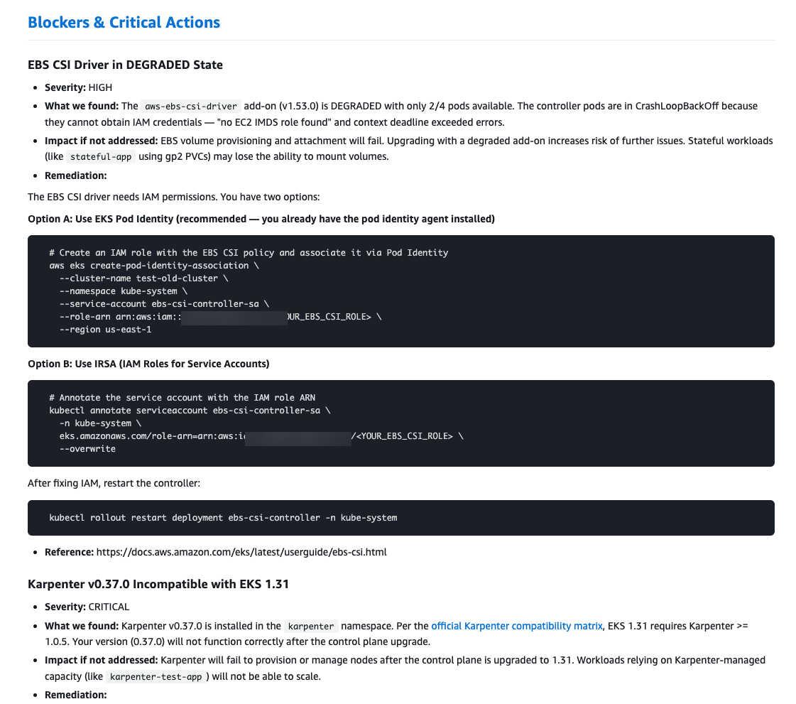
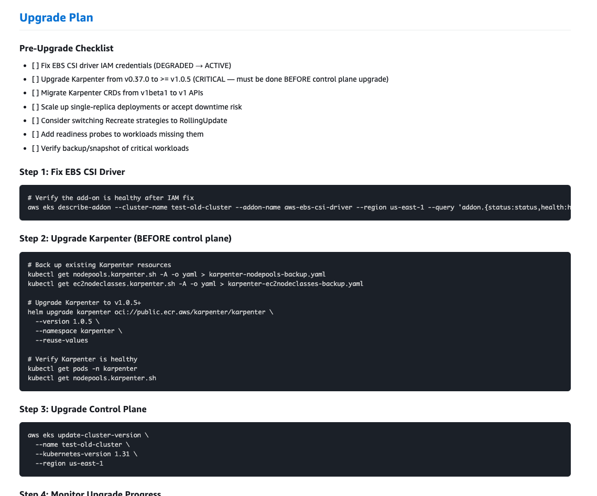

# EKS Upgrade Readiness Skill

[](LICENSE)
[](https://www.python.org/)
[](https://claude.ai/claude-code)

A [Claude Code](https://claude.ai/claude-code) skill that performs automated EKS upgrade readiness assessments. It connects to a live EKS cluster, runs checks across 8 assessment areas, calculates a readiness score (0–100%), and generates a detailed report with pre-filled AWS CLI commands.

Checks are informed by the [EKS Best Practices Guide](https://docs.aws.amazon.com/eks/latest/best-practices/) and [EKS User Guide](https://docs.aws.amazon.com/eks/latest/userguide/). All operations are **read-only** — the skill does not modify your cluster.

<p align="center">
  
</p>

## Table of Contents

- [Getting Started](#getting-started)
- [What Gets Assessed](#what-gets-assessed)
- [Readiness Score](#readiness-score)
- [Output](#output)
- [MCP Server Setup](#mcp-server-setup)
- [Required Permissions](#required-permissions)
- [Limitations](#limitations)
- [Troubleshooting](#troubleshooting)
- [Project Structure](#project-structure)
- [Contributing](#contributing)
- [Security](#security)
- [License](#license)

## Getting Started

### Prerequisites

- [Claude Code](https://docs.anthropic.com/en/docs/claude-code) installed
- [Python 3.10+](https://www.python.org/) and [uv](https://docs.astral.sh/uv/getting-started/installation/)
- AWS credentials configured — `aws sts get-caller-identity` should succeed

### Quick Start

```bash
git clone https://github.com/kahhaw9368/eks-upgrade-skill.git
cd eks-upgrade-skill
claude
```

On first launch, Claude Code will prompt you to enable two MCP servers from `.mcp.json`. **Enable both** — they are required for the skill to work:

- `awslabs.eks-mcp-server` — connects to your EKS cluster
- `awslabs.aws-documentation-mcp-server` — looks up AWS documentation during assessment

Then run:

```
/eks-upgrade
```

The skill discovers your EKS clusters, asks which cluster and target version, and walks you through the assessment.

### Verify Prerequisites

Run the permission check script to validate everything is set up correctly:

```bash
# List available clusters and check basic connectivity
.claude/skills/eks-upgrade/tools/check_permissions.sh

# Check full permissions against a specific cluster
.claude/skills/eks-upgrade/tools/check_permissions.sh my-cluster-name us-west-2
```

## What Gets Assessed

| # | Area | Examples |
|---|------|----------|
| 01 | Version Validation | Upgrade path validity, version skew policy, support status & cost |
| 02 | Breaking Changes | Per-version API removals, behavioral changes, resource impact |
| 03 | Deprecated APIs | Live scan of cluster resources + AWS Upgrade Insights |
| 04 | Add-on Compatibility | Core EKS add-ons, OSS add-ons (via matrix), Karpenter |
| 05 | Node Readiness | AMI type (AL2→AL2023), container runtime, self-managed nodes |
| 06 | Workload Risks | Single replicas, missing PDBs, health probes, resource requests |
| 07 | AWS Upgrade Insights | Official EKS pre-upgrade checks and recommendations |
| 08 | Upgrade Plan | Pre-filled CLI commands with your cluster name and region |

<details>
<summary><strong>Sample findings detail</strong></summary>
<br>
<p align="center">
  
</p>
</details>

## Readiness Score

| Score | Level | Meaning |
|-------|-------|---------|
| 90–100 | READY | Safe to proceed |
| 80–89 | GOOD | Minor issues, can proceed with caution |
| 70–79 | FAIR | Several issues need attention first |
| 60–69 | RISKY | Significant issues, not recommended yet |
| 0–59 | NOT READY | Critical blockers, must resolve first |

## Output

Reports are generated in the workspace root:

| Format | Filename |
|--------|----------|
| Markdown | `EKS-Upgrade-Assessment-<cluster>-<current>-to-<target>-<date>.md` |
| HTML (optional) | `EKS-Upgrade-Assessment-<cluster>-<current>-to-<target>-<date>.html` |

Each report includes a readiness score, score breakdown, blockers & critical actions, per-section findings, and a step-by-step upgrade plan with pre-filled CLI commands.

To convert to HTML: `python3 .claude/skills/eks-upgrade/tools/md_to_html.py <report>.md` (zero external dependencies).

<details>
<summary><strong>Sample upgrade plan</strong></summary>
<br>
<p align="center">
  
</p>
</details>

## MCP Server Setup

This skill uses two MCP servers, both pre-configured in `.mcp.json`. No setup is needed for the default configuration — just clone and run.

<details>
<summary><strong>Switching to the AWS-Managed EKS MCP Server</strong></summary>

The default uses the [open-source EKS MCP server](https://github.com/awslabs/mcp). If your team needs CloudTrail audit logging, automatic updates, or the built-in troubleshooting knowledge base, you can switch to the [AWS-managed EKS MCP server](https://docs.aws.amazon.com/eks/latest/userguide/eks-mcp-introduction.html) instead.

1. Attach the `AmazonEKSMCPReadOnlyAccess` managed policy to your IAM user/role.
2. Replace the `awslabs.eks-mcp-server` block in `.mcp.json` (replace `{region}` with your AWS region):

```json
"awslabs.eks-mcp-server": {
  "command": "uvx",
  "args": [
    "mcp-proxy-for-aws@latest",
    "https://eks-mcp.{region}.api.aws/mcp",
    "--service", "eks-mcp",
    "--profile", "default",
    "--region", "{region}",
    "--read-only"
  ]
}
```

> **Important:** The server name (`"awslabs.eks-mcp-server"`) must stay exactly as shown. Claude Code uses this name to route tool calls — changing it will prevent the skill from working.

See the [Getting Started guide](https://docs.aws.amazon.com/eks/latest/userguide/eks-mcp-getting-started.html) for full setup instructions.

</details>

<details>
<summary><strong>Using a specific AWS profile or region</strong></summary>

Update the `env` block for the EKS MCP server in `.mcp.json`:

```json
"env": {
  "AWS_PROFILE": "your-profile",
  "AWS_REGION": "us-west-2",
  "FASTMCP_LOG_LEVEL": "ERROR"
}
```

</details>

<details>
<summary><strong>Already have MCP servers configured globally?</strong></summary>

Claude Code merges MCP config from global (`~/.claude/settings.json`) and project (`.mcp.json`) levels. If you already have an EKS MCP server configured globally:

- **Same server name** (`awslabs.eks-mcp-server` in both) — the project config takes precedence. No action needed.
- **Different server name** (e.g., `eks-mcp` globally) — both servers will run. Disable the duplicate to avoid conflicts.

</details>

## Required Permissions

### AWS IAM

Minimum IAM permissions:

```
eks:ListClusters, eks:DescribeCluster, eks:ListNodegroups,
eks:DescribeNodegroup, eks:ListAddons, eks:DescribeAddon,
eks:DescribeAddonVersions, eks:ListInsights, eks:DescribeInsight,
eks:ListAccessEntries, eks:DescribeAccessEntry
ec2:DescribeSubnets, ec2:DescribeSecurityGroupRules
iam:GetRole, iam:ListAttachedRolePolicies,
iam:ListRolePolicies, iam:GetRolePolicy
```

> **Tip:** If using the AWS-managed EKS MCP server, attach the `AmazonEKSMCPReadOnlyAccess` managed policy instead.

### Kubernetes RBAC

Your IAM identity needs read access to Kubernetes resources (Nodes, Pods, Deployments, Services, etc.) via an [EKS access entry](https://docs.aws.amazon.com/eks/latest/userguide/access-entries.html) or `aws-auth` ConfigMap.

## Limitations

- **One cluster at a time** — run the skill again for additional clusters.
- **Point-in-time snapshot** — reflects cluster state at the time of the run; does not monitor ongoing changes.
- **Requires cluster access** — your IAM identity must have both AWS API permissions and Kubernetes RBAC access.

## Troubleshooting

<details>
<summary><strong>MCP server not responding</strong></summary>

1. Check Python and uv are installed: `uv --version`
2. Check AWS credentials: `aws sts get-caller-identity`
3. Test the MCP server directly: `uvx awslabs.eks-mcp-server@latest`
4. Verify `AWS_PROFILE` and `AWS_REGION` in `.mcp.json` match your environment

</details>

<details>
<summary><strong>No clusters found</strong></summary>

The skill lists clusters in the region configured in your AWS credentials. To target a different region, set `AWS_REGION` in `.mcp.json` or your environment.

</details>

<details>
<summary><strong>Permission denied errors</strong></summary>

Run the permission check script:

```bash
.claude/skills/eks-upgrade/tools/check_permissions.sh <cluster-name> <region>
```

It will tell you exactly which permissions are missing.

</details>

<details>
<summary><strong>kubectl works but MCP server can't access Kubernetes API</strong></summary>

The MCP server runs in its own process and doesn't inherit your shell environment. Ensure `AWS_PROFILE` and `AWS_REGION` are set in the MCP server's `env` config in `.mcp.json`.

</details>

## Project Structure

```
eks-upgrade-skill/
├── README.md                         # This file
├── LICENSE                           # Apache 2.0 license
├── SECURITY.md                       # Security policy & responsible disclosure
├── .mcp.json                         # MCP server configuration
├── docs/                             # Sample report screenshots
│   ├── sample-report-summary.png
│   ├── sample-report-findings.png
│   └── sample-report-upgrade-plan.png
└── .claude/
    └── skills/
        └── eks-upgrade/
            ├── SKILL.md              # Skill definition & agent workflow
            ├── steering/             # Assessment logic (agent instructions)
            │   ├── version-validation.md
            │   ├── breaking-changes.md
            │   ├── deprecated-apis.md
            │   ├── addon-compatibility.md
            │   ├── node-readiness.md
            │   ├── workload-risks.md
            │   ├── upgrade-insights.md
            │   └── report-generation.md
            ├── data/
            │   └── oss_addon_matrix.json
            └── tools/
                ├── check_permissions.sh
                └── md_to_html.py
```

## Contributing

Contributions are welcome. Please [open an issue](https://github.com/kahhaw9368/eks-upgrade-skill/issues) first to discuss what you'd like to change.

## Security

This skill is **read-only** and does not create, modify, or delete any AWS or Kubernetes resources. All operations are describe, list, and get calls.

If you discover a security vulnerability, please see [SECURITY.md](SECURITY.md) for responsible disclosure instructions. Do not open a public issue for security vulnerabilities.

## License

This project is licensed under the [Apache 2.0 License](LICENSE).
